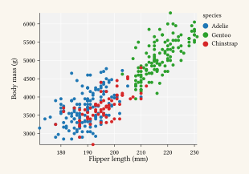
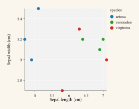
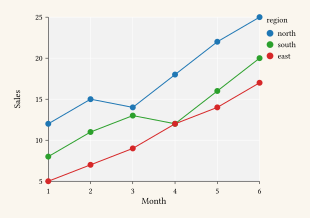
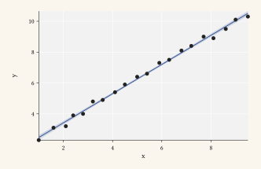
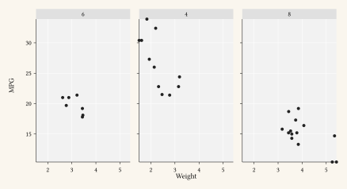

::: {.hero}

::: {.hero-content}
[v]{.pill}

# [gribouille]{.hero-highlight}

### A layered grammar of graphics for [Typst]{.ink}.

Compose charts by layering data, aesthetic mappings, geoms, scales, and themes.
The same grammar as `ggplot2`, drawn natively in Typst.

[Get started](get-started/index.qmd){.btn .btn-primary .btn-lg}
[View on GitHub](https://github.com/mcanouil/gribouille){.btn .btn-outline .btn-lg}
:::

::: {.hero-art}
{fig-alt="A faceted scatter plot of Palmer penguins, flipper length versus body mass, coloured by species."}
:::

:::

::: {.steps}
::: {.step}
### 1. Data.

Bring a CSV, a list of dictionaries, or an inline table.
:::

::: {.step}
### 2. Mapping.

Declare which column drives `x`, `y`, `colour`, `fill`, or `size`.
:::

::: {.step}
### 3. Layers.

Stack geoms, scales, facets, and a theme until the plot is right.
:::
:::

## See it in action

::: {.showcase}

::: {.showcase-code}
```typst
#import "@preview/gribouille:": *

#let df = csv("penguins.csv", row-type: dictionary)

#plot(
  data: df,
  mapping: aes(
    x: "flipper-len",
    y: "body-mass",
    colour: "species",
  ),
  layers: (
    geom-point(size: 2pt),
    geom-smooth(method: "lm"),
  ),
  facet: facet-wrap("island"),
  theme: theme-minimal(),
)
```
:::

::: {.showcase-output}
```{typst}
//| output-filename: "/assets/examples/showcase.svg"
#include "/examples/showcase.typ"
```
:::

:::

## What is in the box

::: {.feature-grid}

::: {.feature}
#### [Geoms.](reference/geoms/index.qmd)

Points, lines, bars, histograms, smoothers, ribbons, boxplots, text, labels, and reference lines.
:::

::: {.feature}
#### [Scales.](reference/scales/index.qmd)

Continuous and discrete x, y, colour, fill, size, shape, linetype, with Viridis and manual palettes.
:::

::: {.feature}
#### [Positions and stats.](reference/index.qmd)

Identity, stack, dodge, and fill positions.
Bin, count, identity, and smooth stats.
:::

::: {.feature}
#### [Facets.](reference/facets/index.qmd)

`facet-wrap` and `facet-grid` with shared or free scales.
:::

::: {.feature}
#### [Themes.](reference/themes/index.qmd)

`theme-minimal`, `theme-classic`, `theme-void`, plus `theme()` element overrides.
:::

::: {.feature}
#### [Composable.](examples.qmd)

Everything is data you can `let`, extend, and reuse across a Typst document.
:::

:::

## A few examples

::: {.gallery-preview}
[](examples.qmd)
[](examples.qmd)
[](examples.qmd)
[](examples.qmd)
:::

[See all examples](examples.qmd){.btn .btn-outline}

::: {.install-band}
## Install.

```bash
typst package add gribouille
```

[Read the getting-started guide](get-started/index.qmd){.btn .btn-primary}
:::

::: {.fine-print}
*gribouille* requires [Typst](https://typst.app) 0.14 or later and [CeTZ](https://typst.app/universe/package/cetz) 0.5 as the drawing backend.
Released under the [MIT Licence](https://github.com/mcanouil/gribouille?tab=MIT-1-ov-file#readme).
:::
